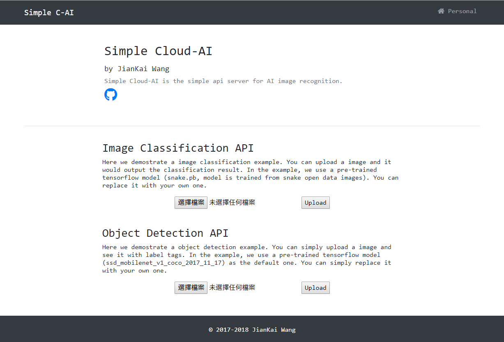

# Simple Cloud AI


Simple Cloud-AI (SCAI) is the simple api server for AI image recognition. The SCAI now provides two types of API, that are image classification and object detection.


The API demo portal :




## Preparation


Before establish two types of cloud AI APIs. You have to make sure of installing the following component.

* python 3.x (better >= 3.5.x)
  * flask package (better >= 0.12.2)
  * numpy package (better >= 1.14.2)
  * matplotlib package (better >= 1.5.3)
  * tensorflow package (better >=1.7.0)
  * PIL package (pillow, better >= 5.1.0)
  * cv2 package (opencv, better >= 3.4.0)
* git (version control)
  * git clone https://github.com/tensorflow/tensorflow.git
  * git clone https://github.com/tensorflow/models.git


We assume you have already **git clone the two main repository** under path `/home/user/tensorflow` and `home/user/models` and install the **tensorflow** package in python (simply `$ pip install tensorflow` or `$ pip install tensorflow-gpu`).


## Folder Structure

The following is the basic API server structure.

```fol
+ .git
+ object_detection (you have to git clone tensorflow/models first, see below)
    + core
    + protos
    + utils
    - __init__.py
+ session (you have to create it for conserving the task session)
+ static (for front-end js or css resource)
+ templates (for portal pages or api accessing)
+ usr (for ai models and label file, and also conserving config file for api settings)
- .gitignore
- index.py (flask main entry)
- label_image.py (modified from tensorflow for image classification core)
- object_detection.py (modified from tensorflow for object detection core)
- README.md
```

The above is the recommanded structure for running scai.


## Image Classification

The image classification is the issue for classifying the image into classes. The output would be the probability standing for how much the image is likely belonging to the specific class. The following is the demo for recognizing a flower image.


### Train your own dataset

Here we simply demo how to use the resource from google tensorflow to train your own dataset.

* Retrain the model

You have to download `retrain.py` from https://github.com/tensorflow/hub/tree/master/examples/image_retraining first, and put it to `tensorflow/tensorflow/examples/image_retraining/`.

You can run the commad like below.

```shell
# the path you git clone tensorflow
cd /home/user/tensorflow/tensorflow/examples/image_retraining/
python retrain.py \
  --bottleneck_dir=bottleneck \
  --how_many_training_step 10000 \
  --model_dir=inception-2015-12-05 \ 
  --output_graph=retrained_graph.pb \
  --output_labels=retrained_labels.txt \
  --image_dir /path/to/your/dataset
```

The `model-dir` can be downloaded from http://download.tensorflow.org/models/image/imagenet/inception-2015-12-05.tgz (for example), and uncompressed it to the same path with retrain.py. **You can also change other inception version from tensorflow.org** (or use `--tfhub_module` to choose different modules).

The `image_dir` structure is simply like below.

```text
# /path/to/your/dataset
+ class1
  - image1.jpg
  - image2.jpg
  - ...
+ class2
  - image1.jpg
  - image2.jpg
  - ...
+ class3
+ ...
```


### Model Optimization

The step is **optional** if you are going to deploy the model on the mobile or development board. After retain the model with your own dataset, the model can be further optimized.

```shell
cd /home/user/tensorflow/tensorflow/examples/image_retraining/
python -m tensorflow.python.tools.optimize_for_inference \
  --input=retrained_graph.pb \
  --output=retrained_graph_op.pb \
  --input_names=module_apply_default/hub_input/Mul \
  --output_names=final_result \
  --frozen_graph=True
```

The `input` is output of `Train your own dataset` on the first step.

The `input_names` could be changed from time to time, you can simple use the following script to find `Mul` under proper scope name.

```python
def listAllOps(PB_PATH):
    with tf.Session() as sess:
        with tf.gfile.FastGFile(PB_PATH, 'rb') as f:
            graph_def = tf.GraphDef()
            graph_def.ParseFromString(f.read())
            sess.graph.as_default()
            tf.import_graph_def(graph_def, name='tfgraph')
            for op in sess.graph.get_operations(): 
                print("{}".format(op.name))

# for exmpale: 
# tfgraph/module_apply_default/hub_input/Mul
listAllOps('retrained_graph.pb')
```


### Classification Test

After you retained the model, or even optimized the model, you can start the classification test.

```shell
python /home/user/tensorflow/tensorflow/examples/label_image/label_image.py \
   --output_layer=final_result \
   --labels=/home/user/tensorflow/tensorflow/examples/image_retraining/retrained_labels.txt \
   --image=/path/to/your/dataset/test_image.jpg \
   --graph=/home/user/tensorflow/tensorflow/examples/image_retraining/retrained_graph_op.pb \
   --input_layer=module_apply_default/hub_input/Mul
```

Here we used a optimizated model (retrained_graph_op.pb) as the example.


### Quantization

The step is **optional** if you are going to deploy the model on the mobile or development board. After retained the model with your own dataset and optimized the retrained model, you can further quantizated the model (you can simply think of it as the data compression) into a small model.

```shell
python /home/user/tensorflow/tensorflow/tools/quantization/quantize_graph.py \
  --input=/home/user/tensorflow/tensorflow/examples/image_retraining/retrained_graph_op.pb \
  --output=/home/user/tensorflow/tensorflow/examples/image_retraining/retrained_op_rounded.pb \
  --output_node_names=final_result \
  --mode=eightbit
```

You would find it simply downsize the model. You can embed it to your resource limited device.


### Once for all: Retrain and Quantization

In google tensorflow, you can simply run the script to retrain and quantize the model once for all.

```shell
cd /home/user/tensorflow/tensorflow/examples/image_retraining/
python retrain.py \
  --bottleneck_dir=bottleneck_mobilenet \
  --how_many_training_step 10000 \
  --image_dir /path/to/your/dataset \
  --tfhub_module https://tfhub.dev/google/imagenet/mobilenet_v1_100_224/quantops/feature_vector/1 \
  --output_graph=retrained_graph_mobilenet_v1.pb \
  --output_labels=retrained_labels.txt
```

You can choose different`tfhub_module `  on the website https://www.tensorflow.org/hub/。


### Configurate API

After you retrained model with your own dataset. You can simply put the model and label into `/usr` folder, and configurate the `/usr/image_classification.config` on the section **default**.

```ini
[default]
LABELS = retrained_labels.txt
GRAPH = retrained_graph_mobilenet_v1.pb
INPUT_LAYER = module_apply_default/hub_input/Mul
OUTPUT_LAYER = final_result
```


## Object Detection

In SCAI, we integrates with lots of tensorflow components.  Object detection is the issue to recognize the specific objects on the image.


For more training details, including labeling, training datasets, model deployment, etc., please refer to https://github.com/jiankaiwang/TF_ObjectDetection_Flow.


## Run API Server


### Command Line

```shell
git clone https://github.com/jiankaiwang/scai.git
cd /home/user/scai
sudo python index.py
```


### Establish the Service

```shell
$ sudo vim /etc/systemd/system/scai.service
```

```shell
[Unit]
Description=Simple Cloud-AI
After=network.target

[Service]
User=root
Group=root
ExecStart=python /home/user/scai/index.py
Restart=always
WorkingDirectory=/home/user/scai

[Install]
WantedBy=multi-user.target
```

```shell
$ sudo systemctl status scai.service
$ sudo systemctl start scai.service
$ sudo systemctl enable scai.service
```


### Access API

```html
url                                                  # e.g. www.example.com, 192.168.1.2, etc.
/                                                    # portal, ui demo webpage
/imageclassification  ['GET','POST'] [return JSON]   # upload image classification api
    /imgclassres  ['GET']  [return JSON]             # get image classification result
        /iciptimg ['GET']  [return IMAGE/PNG]        # get upload image for classification
/objectdetection  ['GET','POST']  [return JSON]      # upload object detection
    /odres  ['GET']  [return JSON]                   # get object detection result
        /odiptimg  ['GET']  [return IMAGE/PNG]       # get upload image for object detection
        /odresimg  ['GET']  [return IMAGE/PNG]       # get result image of object detection
```


